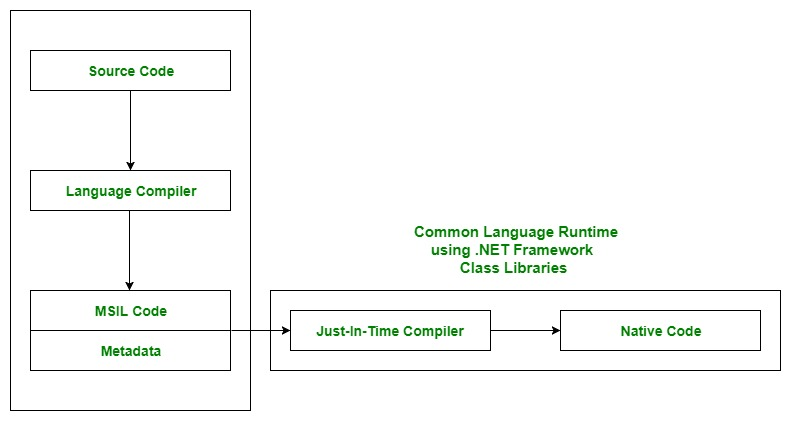

# Common Language Runtime(CLR)

- The CLR is a component of .NET Framework that *manages the execution* of .NET Apps. 
- It is responsible for *loading and execution* of code written in various .NET programming languages like C#, VB.NET, F#, and others.

### Execution of code in .NET Framework 
- When a C# program is compiled, the *resulting executable code* is in an *intermediate language* called Common Intermediate Language (CIL) or Microsoft Intermediate Language (MSIL)
- This code is not machine-specific, and it can run on any platform that has the CLR installed. When the CIL code is executed, the CLR compiles it into machine code that can be executed by the processor.
- The CLR provides many services to .NET applications, including memory management, type safety, security, and exception handling. It also provides ***Just-In-Time (JIT) compilation***, <u>which compiles the CIL code into machine code on the fly as the program runs, optimizing performance.</u>
- Additionally, the CLR provides a framework for developing and deploying .NET applications, including a set of libraries, called the .NET Framework Class Library, which provides access to a wide range of functionality, such as input/output operations, networking, database connectivity, and user interface design.

Some important points:
a. It is the ***run-time environment*** in the .NET Framework that runs the codes and helps in making the development process easier by providing the various services.
b. Basically, it is responsible for managing the execution of .NET programs regardless of any .NET programming language. Internally, CLR implements the VES(Virtual Execution System) which is defined in the Microsoft’s implementation of the CLI(Common Language Infrastructure). 

Let's take the example of a C++ code. 
You code it in windows 11. It runs. 
You take the same code and run it on Linux. 
It will not run.

But it doesn't happen like that in C#. 
Read above to get more data.